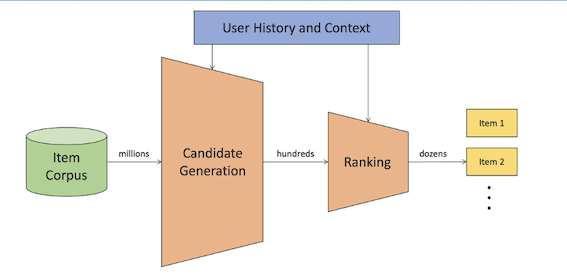
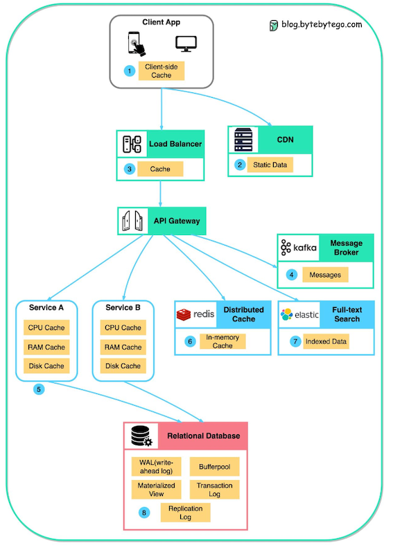
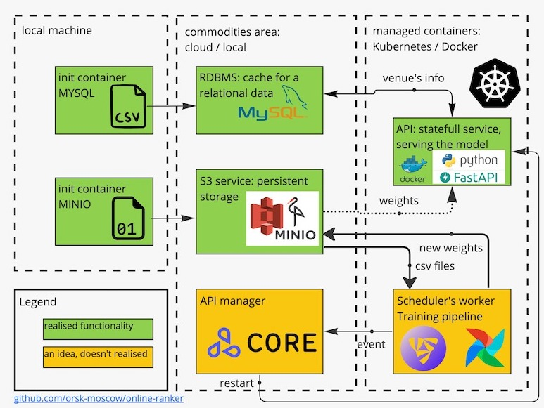

# Table of Contents

1. [Project Description](#project-description)
   * [Project Objectives](#project-objectives)
   * [Additional Details](#additional-details)
2. [Data Sources](#data-sources)
3. [Solution Design](#solution-design)
   * [Overview of the Task](#overview-of-the-task)
   * [Important Parts](#important-parts)
   * [Caching](#caching)
   * [ML Metrics Selection](#ml-metrics-selection)
   * [Solution Structure](#solution-structure)


---
# Project Description

This repository addresses a common scenario in the field of Machine Learning Engineering, particularly within a production environment. It involves building a solution for online reranking of a given list of items, applicable to a wide range of contexts such as goods in e-commerce, restaurants in food delivery services, audio tracks or movies in online streaming, etc. 

A central aspect of the task involves working with an anonymized dataset of user sessions. The solution includes training a ranking model for the optimal presentation of content. The model's role is to evaluate and rearrange items within a user session, thereby prioritizing the "best" or most appropriate items for the user.

## Project Objectives:

1. **Development of a Training Pipeline:** The primary goal is to create a class or method capable of processing two distinct datasets. One dataset includes variable session data, while the other contains static item attributes. The pipeline should effectively train the model, leading to the production of a model artifact and relevant metrics.

2. **Establishment of an Inference Service:** The project requires the creation of a REST service. This service should be capable of accepting a list of item IDs and corresponding features from a request. If necessary, it should enrich these features using a cache, utilize the features and a model artifact to make predictions, and return a list of item IDs with associated scores.

3. **Docker Integration:** The inference service and cache should be incorporated into Docker containers and orchestrated appropriately.

4. **Selection of Model and Frameworks:** Given the real-time scoring requirements of the model, it is crucial to select appropriate models and frameworks.

5. **Adherence to Coding Standards:** The code should follow best practices, including correct formatting, the usage of type hints, and inclusion of informative comments. Python is the recommended language for this project.

6. **Proposition of Future Enhancements:** Given the limited development timeline, it may not be feasible to address all intricate details. Therefore, potential enhancements have been identified and registered as issues within the repository.

## Additional Details:

The provided dataset is designed to mirror real-world situations, complete with their complexities. Some significant column details include:

- `has_seen_item_in_this_session`: If false, the user has not seen this item during the session.
- `is_new_user`: Indicates whether the user is new to the platform.
- `is_from_order_again`: Denotes whether the user has previously ordered this item.
- `is_recommended`: Represents an unspecified personalized recommendation available at prediction time.

The approach to this project emphasizes the clarity and quality of the code, comprehension of basic principles, and the rationale behind decisions made. The design doesn't need to be excessively detailed, but it showcase a sound understanding of the project's requirements.

---
# Data Sources

The primary data is hosted on GitHub and can be retrieved through several methods.

1. A straightforward bash script:

```bash
wget https://github.com/orsk-moscow/online-ranker/releases/download/v0.1/sessions.csv.zip && \
unzip sessions.csv.zip -d ./s3/ && \
wget https://github.com/orsk-moscow/online-ranker/releases/download/v0.1/venues.csv.zip && \
unzip venues.csv.zip -d ./cache/
```

2. Downloading manually by accessing this links:

- https://github.com/orsk-moscow/online-ranker/releases/download/v0.1/sessions.csv.zip
- https://github.com/orsk-moscow/online-ranker/releases/download/v0.1/venues.csv.zip

Once the download is complete, decompress the archives and organize them as follows:

- Session Data should be placed in `s3/sessions.csv`
- Item Data should be placed in `cache/venues.csv`

After this procedure, note that you can access the data via these paths:

- [Session Data: s3/sessions.csv](s3/sessions.csv)
- [Item Data: cache/venues.csv](cache/venues.csv)

---
# Solution Design

## Overview of the Task
The task assumes preselected venue candidates, identified by `session_id`, need ranking based on the user and venue context. 
This fits into the second step of typical ranking system design: solving a learning-to-rank problem via specific metric optimization.
Roughly, it could be visualize via this picture:



## Important parts

The Machine Learning solution (or system) design of the project is as follows:

1. **Data Ingestion:** Our solution will start with the data ingestion process. The two distinct datasets, one containing session data and another with static item attributes, will be ingested into the system for processing.

2. **Explorative Data Analysis and Feature Engineering:** Once we have our data ready, we'll move to feature engineering. In this step, we work primarily in Jupyter notebook and construct meaningful features from the raw data that can better represent the underlying patterns to the predictive model. This is a critical step because the quality of features can significantly influence the model's performance. 

3. **Model Training:** Post feature engineering, the processed data will be fed into the training pipeline to train our ranking model. The model will learn to rank the items within each user session, prioritizing the most appropriate items for the user.

4. **Model Evaluation:** After training the model, it is crucial to evaluate its performance. For this, we would use relevant metrics that align with the objectives of the task.

5. **Inference Service:** Once we're satisfied with the model's performance, we would deploy it as part of a RESTful service. This service would receive item IDs and their features, enhance these features if required, use the model to make predictions, and return a list of item IDs with their associated scores.

6. **Continuous Monitoring and Improvement:** 
After the deployment, the model performance should be continuously monitored. 
We should collect feedback and make necessary adjustments to our model or system based on this feedback.

Parts 4 and 6 have been declared, but are not yet implemented.


## Caching

- The term "Cache" refers to a key-value storage system.
- There are several available options for this system (as depicted in the image).
- The data scheme aligns well with the Relational Database Management System (RDBMS) pattern.
- Accordingly, the venue data is stored in [MySQL](https://en.wikipedia.org/wiki/MySQL).
- The key utilized in this system is `venue_id`, with other columns serving as values.
- The `venue_id` is indexed using a [Btree index](https://en.wikipedia.org/wiki/B-tree).
- Utilizing a [RDS service](https://aws.amazon.com/rds/?nc1=h_ls) allows for access times between 2-5 ms.


## ML Metrics Selection

In a machine learning project, the appropriate choice of evaluation metric is critical. Since the objective here is to build a ranking model, the chosen metric should evaluate the quality of the ranking.

Several possible candidates are:

1. [DCG@k & nDCG@k](https://en.wikipedia.org/wiki/Discounted_cumulative_gain)
2. [MAP@k](https://en.wikipedia.org/wiki/Evaluation_measures_(information_retrieval)#Mean_average_precision)
3. [MRR](https://en.wikipedia.org/wiki/Mean_reciprocal_rank)
4. [HR](https://en.wikipedia.org/wiki/Hit_rate)
5. [Other metrics](https://en.wikipedia.org/wiki/Evaluation_measures_(information_retrieval))

After considering these options, Mean Average Precision (MAP) was selected for this project. The evaluation was done at top 10 items (topK=10), a choice that is well-aligned with typical page sizes on web and mobile devices.

One of the advantages of MAP is that it can be directly calculated for the validation set using the CatBoost ranker. Additionally, the [YetiRank](https://catboost.ai/en/docs/concepts/loss-functions-ranking#YetiRank) loss function was selected for model training. This loss function is known for its ability to learn a [list-wise type of ranking](https://medium.com/@nikhilbd/pointwise-vs-pairwise-vs-listwise-learning-to-rank-80a8fe8fadfd).

## Solution Structure

The solution is modular, composed of various interconnected parts as illustrated in the scheme below:

1. Storage for binary files.
2. Storage for relational data.
3. Scripts for infrastructure startup and data uploading.
4. API inference service.
5. Training pipeline, implemented as an independent container.

Each module is currently served via Docker Compose. However, the solution is flexible and can be adapted to employ cloud-based services as needed.


